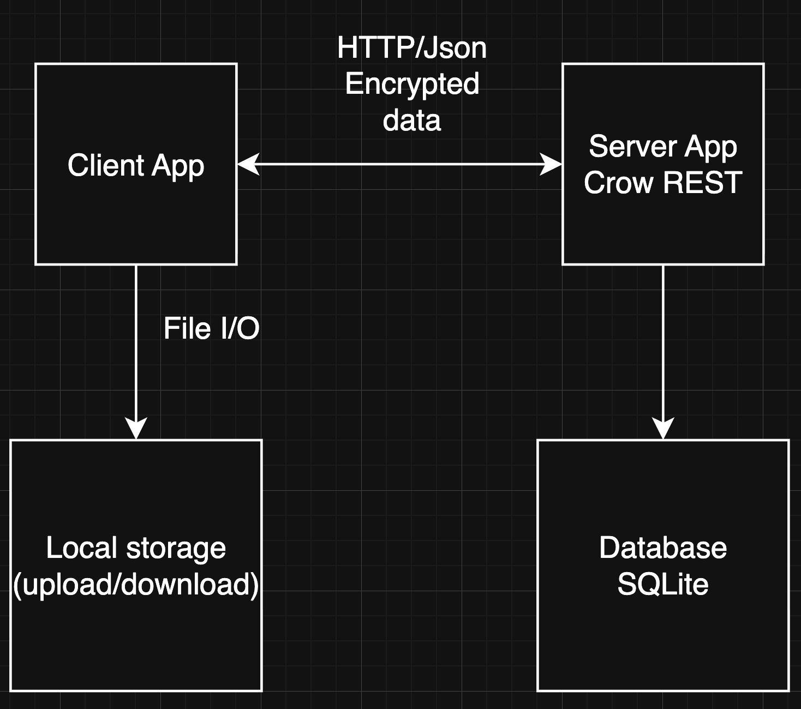
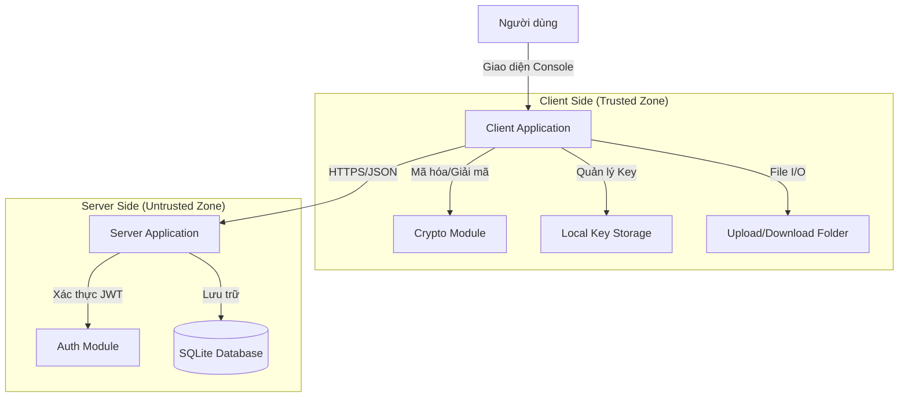
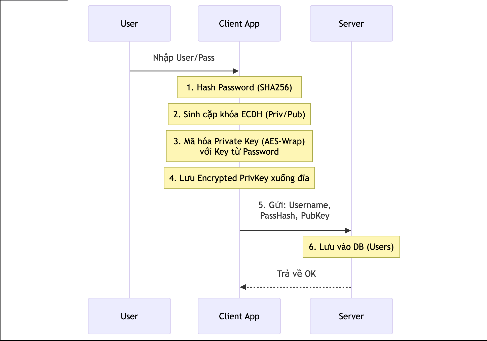
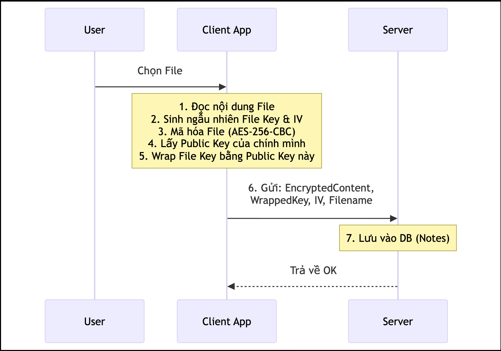
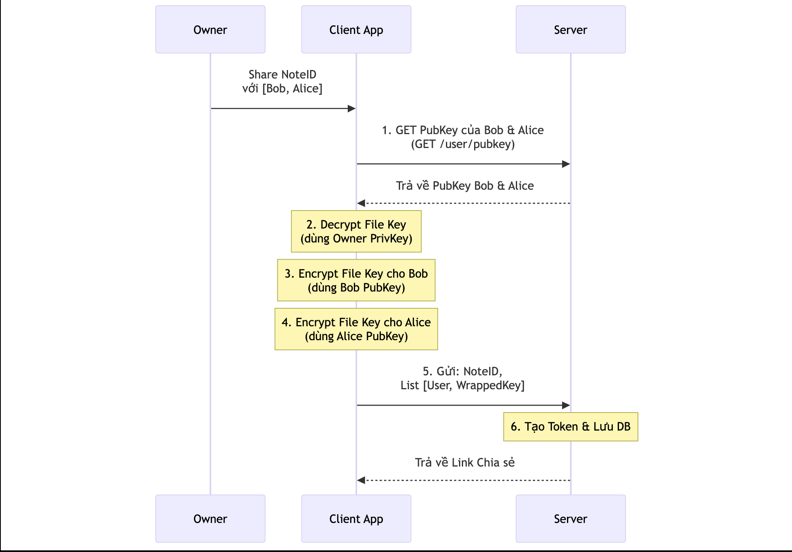

# BÁO CÁO ĐỒ ÁN LAB 02 - MẬT MÃ HỌC ỨNG DỤNG

## MỤC LỤC
1. [Tổng quan ứng dụng](#1-tổng-quan-ứng-dụng)

---

## 1. TỔNG QUAN ỨNG DỤNG

### 1.1. Mục tiêu ứng dụng

**Secure Note Sharing Application** là ứng dụng chia sẻ ghi chú an toàn với mã hóa end-to-end (E2EE), được phát triển nhằm đảm bảo tính bảo mật và riêng tư tuyệt đối cho dữ liệu người dùng. Ứng dụng triển khai các cơ chế mật mã hiện đại để bảo vệ thông tin từ đầu đến cuối quá trình truyền tải và lưu trữ.

**Mục tiêu chính:**
- **Bảo mật tuyệt đối**: Dữ liệu được mã hóa end-to-end, server không thể đọc nội dung
- **Quản lý khóa an toàn**: Sử dụng ECDH để trao đổi khóa một cách bảo mật
- **Chia sẻ linh hoạt**: Hỗ trợ chia sẻ qua link tạm thời hoặc trực tiếp cho người dùng
- **Xác thực mạnh mẽ**: JWT token với thời gian hết hạn để bảo vệ phiên làm việc
- **Hỗ trợ đa dạng**: Upload/download mọi loại file với tên file gốc được bảo toàn

### 1.2. Kiến trúc hệ thống

Ứng dụng được xây dựng theo mô hình **Client-Server** với kiến trúc 3 tầng:

**Thành phần chính:**

1. **Server (Backend)**
   - Framework: Crow (C++ HTTP server)
   - Database: SQLite3
   - Port: 8080
   - Chức năng: Xử lý API, quản lý xác thực, lưu trữ dữ liệu đã mã hóa

2. **Client (Frontend)**
   - Giao diện: Console Application (C++)
   - HTTP Client: cpp-httplib
   - Chức năng: Tương tác người dùng, mã hóa/giải mã dữ liệu

3. **Common Crypto Library**
   - OpenSSL 3.x
   - Chức năng: Cung cấp các hàm mật mã cho cả client và server

### 1.3. Cách chạy chương trình từ mã nguồn

#### **Bước 1: Chuẩn bị môi trường**

**Yêu cầu hệ thống:**
- Windows 10/11
- MSYS2 với GCC 14.2.0 hoặc cao hơn
- OpenSSL 3.x

**Cài đặt công cụ:**

```powershell
# 1. Cài MSYS2
winget install MSYS2.MSYS2

# 2. Mở MSYS2 UCRT64 terminal và cài các package cần thiết
pacman -Syu
pacman -S mingw-w64-ucrt-x86_64-gcc mingw-w64-ucrt-x86_64-openssl

# 3. Thêm vào PATH (PowerShell)
$env:PATH = "C:\msys64\ucrt64\bin;$env:PATH"
```

**Kiểm tra cài đặt:**
```powershell
g++ --version      # Phải >= 14.2.0
openssl version    # Phải OpenSSL 3.x
```

#### **Bước 2: Build ứng dụng**

**Cách 1: Build tất cả bằng 1 lệnh (Khuyến nghị)**
```powershell
# Từ thư mục gốc của project
.\build_all.ps1
```

Script này sẽ tự động:
- Biên dịch SQLite3
- Biên dịch tất cả module của server (server_main, Auth, Database, Crypto)
- Biên dịch tất cả module của client (client_main, client_app_logic, network, Crypto)
- Link các module và tạo file thực thi
- Hiển thị kết quả từng bước

**Cách 2: Build thủ công từng phần**

*Server:*
```powershell
gcc -c vendor/sqlite3.c -o sqlite3.o
g++ -c server/server_main.cpp -o server_main.o -std=c++17 -I vendor/asio_lib -I vendor
g++ -c server/Auth.cpp -o Auth.o -std=c++17 -I vendor
g++ -c server/Database.cpp -o Database.o -std=c++17 -I vendor
g++ -c common/Crypto.cpp -o Crypto.o -std=c++17 -I vendor
g++ server_main.o Auth.o Database.o Crypto.o sqlite3.o -o server_app.exe -lws2_32 -lwsock32 -lcrypto -lssl
```

*Client:*
```powershell
g++ -c client_main.cpp -o client_main.o -std=c++17 -I vendor -D_WIN32_WINNT=0x0A00
g++ -c client/client_app_logic.cpp -o client_app_logic.o -std=c++17 -I vendor -D_WIN32_WINNT=0x0A00
g++ -c client/network.cpp -o network.o -std=c++17 -I vendor -D_WIN32_WINNT=0x0A00
g++ client_main.o client_app_logic.o network.o Crypto.o -o client_app.exe -lws2_32 -lwsock32 -lcrypto -lssl -lcrypt32
```

**Clean và rebuild:**
```powershell
.\build_all.ps1 -Clean
```

#### **Bước 3: Chạy ứng dụng**

**Mở 2 terminal riêng biệt:**

*Terminal 1 - Khởi động Server:*
```powershell
cd L:\Nam4_ki1\Crypto\Lab\Lab02\Project
.\server_app.exe
```

Kết quả mong đợi:
```
Server running on port 8080
```

*Terminal 2 - Chạy Client:*
```powershell
cd L:\Nam4_ki1\Crypto\Lab\Lab02\Project
.\client_app.exe
```

Menu client sẽ hiển thị:
```
=== SECURE NOTE APP ===
1. Dang ky
2. Dang nhap
3. Upload file
4. Tai file ve
5. Liet ke ghi chu
6. Xoa ghi chu
7. Tao link chia se tam thoi
8. Xem ghi chu ban da chia se
9. Truy cap link chia se
10. Huy chia se
0. Thoat
Chon:
```

#### **Bước 4: Sử dụng cơ bản**

**Luồng sử dụng điển hình:**

1. **Đăng ký tài khoản**
   - Chọn option `1`
   - Nhập username và password
   - Hệ thống tự động tạo cặp khóa ECDH

2. **Đăng nhập**
   - Chọn option `2`
   - Nhập username và password
   - Nhận JWT token (có hiệu lực 30 phút)

3. **Upload file**
   - Đặt file cần upload vào thư mục `upload/`
   - Chọn option `3`
   - Nhập tên file
   - File được mã hóa tự động trước khi gửi lên server

4. **Xem danh sách ghi chú**
   - Chọn option `5`
   - Hiển thị tất cả notes đã upload

5. **Tải file về**
   - Chọn option `4`
   - Nhập ID của note
   - File được giải mã tự động và lưu vào `download/`

6. **Chia sẻ file**
   - Chọn option `7`
   - Nhập ID note, danh sách username được phép truy cập, thời gian hết hạn
   - Nhận link chia sẻ tạm thời

7. **Truy cập link chia sẻ**
   - Chọn option `9`
   - Nhập token từ link
   - File được giải mã và lưu vào `download/`

### 1.4. Các chức năng đã triển khai

#### **A. Chức năng cơ bản**

| STT | Chức năng | Mô tả | API Endpoint |
|-----|-----------|-------|--------------|
| 1 | **Đăng ký người dùng** | Tạo tài khoản mới với password được hash bằng SHA-256 và PBKDF2. Tự động sinh cặp khóa ECDH (Receive Key) cho người dùng. | `POST /register` |
| 2 | **Đăng nhập** | Xác thực username/password, trả về JWT token có thời gian sống 30 phút. | `POST /login` |
| 3 | **Upload ghi chú** | Mã hóa nội dung bằng AES-256-CBC, upload lên server kèm wrapped key và IV. Hỗ trợ mọi loại file. | `POST /upload` |
| 4 | **Liệt kê ghi chú** | Hiển thị danh sách các note của người dùng hiện tại (chỉ metadata, không có nội dung). | `GET /notes` |
| 5 | **Xem ghi chú** | Tải về note theo ID, giải mã và hiển thị nội dung. | `GET /note/:id` |
| 6 | **Xóa ghi chú** | Xóa note khỏi database (chỉ chủ sở hữu). | `DELETE /note/:id` |
| 7 | **Download file** | Tải về file đã mã hóa, giải mã và lưu với tên file gốc. | `POST /download_note` |

#### **B. Chức năng chia sẻ nâng cao**

| STT | Chức năng | Mô tả | API Endpoint |
|-----|-----------|-------|--------------|
| 8 | **Tạo link chia sẻ** | Tạo link tạm thời với whitelist username. Mỗi người được phép truy cập có Send Public Key và Wrapped Key riêng. | `POST /share/link` |
| 9 | **Truy cập link chia sẻ** | Truy cập note qua token, tự động giải mã bằng Session Key từ ECDH. | `GET /share/:token` |
| 10 | **Hủy chia sẻ** | Xóa link chia sẻ (chỉ người tạo link). | `DELETE /share/:token` |
| 11 | **Xem notes đã chia sẻ** | Liệt kê các note mà người dùng đã chia sẻ cho người khác, bao gồm danh sách người được chia sẻ. | `GET /myshares` |
| 12 | **Lấy public key** | Truy vấn Receive Public Key của user khác (để thực hiện ECDH). | `GET /user/:username/pubkey` |

#### **C. Bảo mật và xác thực**

| STT | Chức năng | Mô tả | Chi tiết kỹ thuật |
|-----|-----------|-------|-------------------|
| 1 | **JWT Authentication** | Xác thực mọi request yêu cầu quyền (trừ register/login). Token có thời gian sống 30 phút. | Header: `Authorization: Bearer <token>` |
| 2 | **Password Hashing** | Password không lưu plaintext, chỉ lưu hash. | SHA-256 + PBKDF2 (10,000 iterations) với salt ngẫu nhiên |
| 3 | **End-to-End Encryption** | Server không thể đọc nội dung file. Chỉ client có khóa giải mã. | AES-256-CBC với key được wrap |
| 4 | **Key Wrapping** | Các file key được wrap bằng Master Key (từ password) hoặc Session Key (từ ECDH). | AES-256-CBC key wrapping |
| 5 | **Access Control** | Người dùng chỉ truy cập được note của mình hoặc note được chia sẻ hợp lệ. | Database + Token validation |

### 1.5. Tính năng nâng cao

#### **1. Hỗ trợ tên file gốc (Filename Preservation)**

**Vấn đề giải quyết:**  
Nhiều hệ thống chỉ lưu ID hoặc hash của file, khiến người dùng không biết file gốc là gì.

**Giải pháp:**
- Lưu trữ tên file gốc trong database (trường `filename`)
- Khi download, tự động đặt lại tên file gốc
- Client tự động tạo thư mục `upload/` và `download/` nếu chưa có

**Ví dụ:**
```
Upload: upload/thesis.pdf → Lưu với filename="thesis.pdf"
Download: ID=123 → Tải về download/thesis.pdf
```

#### **2. Whitelist-based Sharing**

**Đặc điểm:**
- Không phải ai có link cũng truy cập được
- Chỉ những username trong danh sách mới có quyền
- Mỗi người có Session Key riêng (qua ECDH)

**Quy trình:**
```
1. Alice tạo link share cho Bob và Charlie
2. Server tạo token, lưu whitelist: [Bob, Charlie]
3. Bob truy cập → Server check username → OK
4. Dave truy cập → Server check username → DENIED (403)
```

**Database schema:**
```sql
-- Bảng SharedLinkAccess lưu từng username được phép
CREATE TABLE SharedLinkAccess (
    id INTEGER PRIMARY KEY,
    link_id INTEGER,
    username TEXT,
    send_public_key_hex TEXT,
    wrapped_key TEXT,
    FOREIGN KEY(link_id) REFERENCES SharedLinks(id)
);
```

#### **3. Expiration Time cho Share Links**

**Tính năng:**
- Mọi link chia sẻ đều có thời gian hết hạn
- Server tự động kiểm tra khi truy cập
- Link hết hạn trả về lỗi 403

**Cách hoạt động:**
```cpp
// Khi tạo link
int duration_seconds = 3600; // 1 giờ
long long expiration_time = current_time() + duration_seconds;

// Khi truy cập
if (current_time() > expiration_time) {
    return 403; // Link đã hết hạn
}
```

**Lợi ích:**
- Giảm rủi ro link bị leak sau một thời gian dài
- Người dùng kiểm soát được thời gian chia sẻ

#### **4. My Shares API - Quản lý sharing đã tạo**

**Endpoint mới:** `GET /myshares`

**Chức năng:**
- Liệt kê tất cả notes mà người dùng đã chia sẻ
- Hiển thị danh sách người được chia sẻ cho từng note
- Hiển thị trạng thái hết hạn

**Response format:**
```json
[
  {
    "note_id": 1,
    "share_link": "http://localhost:8080/share/abc123...",
    "expiration_time": 1765542313,
    "is_expired": false,
    "shared_with": ["bob_test", "charlie_test"]
  }
]
```

**Ưu điểm:**
- Người dùng biết mình đang chia sẻ gì với ai
- Dễ dàng theo dõi và quản lý quyền truy cập
- Hỗ trợ audit trail

#### **5. Automated Test Suite**

**Đặc điểm:**
- 13 test cases tự động bằng C++
- Không cần Python hay tool bên ngoài
- Config qua file JSON (`test/test_config.json`)

**Test categories:**
1. **Authentication Tests** (5 tests)
   - Register success/duplicate
   - Login success/wrong password/non-existent user
   - Request without token

2. **Basic Operations** (3 tests)
   - Upload note
   - List notes
   - Get note by ID

3. **Access Control** (3 tests)
   - Unauthorized access denied
   - Create share link
   - Whitelist user can access

4. **My Shares API** (2 tests)
   - List shares
   - Verify shared_with array

**Chạy test:**
```powershell
# Build test
g++ test/auto_test.cpp -o auto_test.exe -std=c++17 -I vendor -D_WIN32_WINNT=0x0A00 -lws2_32 -lwsock32 -lcrypt32

# Chạy test (server phải đang chạy)
.\auto_test.exe
```

**Kết quả:**
```
============================================================
FINAL RESULTS
============================================================
Total: 13/13 tests passed
Success Rate: 100.0%

ALL TESTS PASSED!
```

#### **6. Build Script tự động**

**File:** `build_all.ps1`

**Tính năng:**
- Build cả server và client bằng 1 lệnh
- Hiển thị progress từng bước
- Tự động kiểm tra lỗi
- Hỗ trợ clean build

**Sử dụng:**
```powershell
.\build_all.ps1           # Build bình thường
.\build_all.ps1 -Clean    # Xóa artifacts cũ và build lại
```

**Output:**
```
=======================================
  Building Server...
=======================================
[1/6] Compiling sqlite3.c... OK
[2/6] Compiling server_main.cpp... OK
[3/6] Compiling Auth.cpp... OK
[4/6] Compiling Database.cpp... OK
[5/6] Compiling Crypto.cpp... OK
[6/6] Linking server_app.exe... OK

Server build successful: server_app.exe
...
Build completed successfully!
```

### 1.6. Công nghệ sử dụng

**Bảng tổng hợp:**

| Thành phần | Công nghệ | Phiên bản | Mục đích |
|------------|-----------|-----------|----------|
| **Ngôn ngữ** | C++ | C++17 | Ngôn ngữ lập trình chính |
| **Compiler** | GCC (MSYS2) | 14.2.0 | Biên dịch mã nguồn |
| **Server Framework** | Crow | Header-only | HTTP server với routing |
| **HTTP Client** | cpp-httplib | Header-only | HTTP client cho test và client app |
| **Database** | SQLite3 | 3.x | Lưu trữ dữ liệu đã mã hóa |
| **JSON Parser** | nlohmann/json | Latest | Parse/serialize JSON |
| **Cryptography** | OpenSSL | 3.x | Các hàm mật mã |
| **Key Exchange** | ECDH | secp256k1 | Trao đổi khóa an toàn |
| **Encryption** | AES-256-CBC | - | Mã hóa đối xứng |
| **Key Derivation** | PBKDF2-SHA256 | 10k iterations | Sinh khóa từ password |
| **Authentication** | JWT | Custom | Xác thực token |

**Lý do lựa chọn:**

1. **C++17**: 
   - Performance cao
   - Hỗ trợ tốt cho cryptography
   - Memory safety với RAII

2. **OpenSSL**:
   - Library mật mã được tin cậy nhất
   - Hỗ trợ đầy đủ các thuật toán chuẩn
   - Được kiểm toán bảo mật kỹ lưỡng

3. **SQLite**:
   - Embedded database, không cần server riêng
   - ACID compliant
   - Dễ deploy và backup

4. **Crow Framework**:
   - Header-only, dễ tích hợp
   - Syntax giống Flask (Python)
   - Performance tốt

### 1.7. Cấu trúc thư mục

```
Project/
├── server/                      # Server code
│   ├── server_main.cpp          # API endpoints (14 APIs)
│   ├── Auth.cpp / Auth.h        # JWT authentication
│   └── Database.cpp / Database.h # SQLite operations (5 tables)
│
├── client/                      # Client code  
│   ├── client_app_logic.cpp/.h  # Business logic
│   └── network.cpp / network.h  # HTTP client wrapper
│
├── common/                      # Shared code
│   ├── Crypto.cpp / Crypto.h    # Crypto functions
│   └── Protocol.h               # Data structures
│
├── test/                        # Test suite
│   ├── auto_test.cpp            # 13 automated tests
│   ├── test_config.json         # Test configuration
│   ├── build_and_run.ps1        # Test runner script
│   └── *.md                     # 40 manual test cases
│
├── vendor/                      # Third-party libraries
│   ├── crow_all.h               # HTTP server
│   ├── httplib.h                # HTTP client
│   ├── json.hpp                 # JSON parser
│   ├── sqlite3.c / sqlite3.h    # Database
│   └── asio_lib/                # Async I/O (for Crow)
│
├── keys/                        # User private keys (encrypted)
├── upload/                      # Upload staging area
├── download/                    # Downloaded files
│
├── build_all.ps1                # Build script
├── README.md                    # Documentation
├── REPORT.md                    # This file
└── secure_notes.db              # SQLite database (created at runtime)
```

### 1.8. Database Schema

**5 bảng chính:**

```sql
-- 1. Users: Thông tin người dùng
CREATE TABLE Users (
    id INTEGER PRIMARY KEY AUTOINCREMENT,
    username TEXT UNIQUE NOT NULL,
    password_hash TEXT NOT NULL,
    salt TEXT NOT NULL,
    receive_public_key_hex TEXT NOT NULL
);

-- 2. Notes: Ghi chú đã mã hóa
CREATE TABLE Notes (
    id INTEGER PRIMARY KEY AUTOINCREMENT,
    user_id INTEGER NOT NULL,
    encrypted_content TEXT NOT NULL,
    wrapped_key TEXT NOT NULL,
    iv_hex TEXT NOT NULL,
    filename TEXT,
    created_at INTEGER NOT NULL,
    FOREIGN KEY(user_id) REFERENCES Users(id)
);

-- 3. SharedLinks: Link chia sẻ tạm thời
CREATE TABLE SharedLinks (
    id INTEGER PRIMARY KEY AUTOINCREMENT,
    token TEXT UNIQUE NOT NULL,
    note_id INTEGER NOT NULL,
    owner_id INTEGER NOT NULL,
    expiration_time INTEGER NOT NULL,
    FOREIGN KEY(note_id) REFERENCES Notes(id),
    FOREIGN KEY(owner_id) REFERENCES Users(id)
);

-- 4. SharedLinkAccess: Whitelist cho link
CREATE TABLE SharedLinkAccess (
    id INTEGER PRIMARY KEY AUTOINCREMENT,
    link_id INTEGER NOT NULL,
    username TEXT NOT NULL,
    send_public_key_hex TEXT NOT NULL,
    wrapped_key TEXT NOT NULL,
    FOREIGN KEY(link_id) REFERENCES SharedLinks(id)
);

-- 5. UserShares: Chia sẻ trực tiếp giữa users
CREATE TABLE UserShares (
    id INTEGER PRIMARY KEY AUTOINCREMENT,
    note_id INTEGER NOT NULL,
    sender_id INTEGER NOT NULL,
    recipient_id INTEGER NOT NULL,
    send_public_key_hex TEXT NOT NULL,
    new_wrapped_key TEXT NOT NULL,
    expiration_time INTEGER,
    FOREIGN KEY(note_id) REFERENCES Notes(id),
    FOREIGN KEY(sender_id) REFERENCES Users(id),
    FOREIGN KEY(recipient_id) REFERENCES Users(id)
);
---
```
## 2. THIẾT KẾ VÀ KIẾN TRÚC

### 2.1. Kiến trúc hệ thống

Hệ thống được thiết kế theo mô hình **Client-Server** truyền thống nhưng với sự khác biệt quan trọng trong việc xử lý dữ liệu: **Mô hình Zero-Knowledge**. Server chỉ đóng vai trò là kho lưu trữ dữ liệu mù (blind storage) và bộ điều phối xác thực, trong khi toàn bộ logic mã hóa và giải mã diễn ra tại Client.

**Sơ đồ kiến trúc tổng quát:**



*(Lưu ý: Sơ đồ trên mô tả luồng dữ liệu và các vùng tin cậy)*

### 2.2. Các thành phần chính

#### **1. Client Application (Frontend)**
- **Vai trò**: Giao tiếp với người dùng, thực hiện các phép toán mật mã, và gửi request đến server.
- **Đặc điểm**:
  - **Stateful**: Lưu trữ trạng thái đăng nhập (JWT) và keys tạm thời.
  - **Secure**: Không bao giờ gửi khóa giải mã (Private Key) ra ngoài.
  - **Interactive**: Menu điều khiển qua dòng lệnh.

#### **2. Server Application (Backend)**
- **Vai trò**: Cung cấp RESTful API, quản lý cơ sở dữ liệu, và điều phối chia sẻ.
- **Đặc điểm**:
  - **Stateless**: Sử dụng JWT cho xác thực, không lưu session server-side.
  - **Passive**: Chỉ phản hồi request, không chủ động xử lý dữ liệu mã hóa.
  - **Concurrent**: Sử dụng Crow framework để xử lý nhiều request đồng thời.

#### **3. Database (Storage)**
- **Vai trò**: Lưu trữ bền vững dữ liệu người dùng và file.
- **Đặc điểm**:
  - **Relational**: Sử dụng SQLite với 5 bảng quan hệ chặt chẽ.
  - **Encrypted Content**: Các trường nội dung (`encrypted_content`, `wrapped_key`) đều lưu dưới dạng Hex/Base64 của dữ liệu đã mã hóa.

#### **4. Crypto Module (Shared Library)**
- **Vai trò**: Cung cấp các hàm mật mã chuẩn cho cả Client và Server.
- **Đặc điểm**:
  - **Wrapper**: Bao đóng các hàm phức tạp của OpenSSL thành API đơn giản (ví dụ: `encryptAES`, `hashSHA256`).
  - **Consistency**: Đảm bảo thuật toán thống nhất giữa hai đầu.

### 2.3. Công nghệ và Công cụ sử dụng

Bảng dưới đây liệt kê chi tiết các công nghệ, thư viện và công cụ được sử dụng trong dự án:

| Loại | Tên công cụ/Thư viện | Phiên bản | Ghi chú |
|------|----------------------|-----------|---------|
| **Ngôn ngữ lập trình** | C++ | Standard 17 (C++17) | Sử dụng các tính năng hiện đại như `std::filesystem`, `std::optional`. |
| **Trình biên dịch** | GCC (GNU Compiler Collection) | 14.2.0 | Cài đặt qua MSYS2 UCRT64 trên Windows. |
| **Thư viện Mật mã** | OpenSSL | 3.x | Thư viện chuẩn công nghiệp cho crypto. |
| **Web Framework** | Crow | Latest (Master branch) | C++ Microframework cho Web (Header-only). |
| **HTTP Client** | cpp-httplib | 0.14.1+ | Thư viện HTTP client đơn giản (Header-only). |
| **Cơ sở dữ liệu** | SQLite | 3.42+ | Database engine nhỏ gọn, không cần server riêng. |
| **Xử lý JSON** | nlohmann/json | 3.11.2 | Thư viện JSON for Modern C++. |
| **Build System** | PowerShell Script | 5.1 / 7.x | Script tự viết để build tự động (`build_all.ps1`). |
| **IDE/Editor** | Visual Studio Code | Latest | Môi trường phát triển tích hợp. |

### 2.4. Mục đích thiết kế

Thiết kế của hệ thống tuân theo 3 nguyên tắc bảo mật cốt lõi:

1.  **Confidentiality (Tính bí mật)**:
    *   **End-to-End Encryption**: Dữ liệu được mã hóa tại máy người gửi và chỉ được giải mã tại máy người nhận. Server chỉ thấy rác (ciphertext).
    *   **Key Wrapping**: Khóa mã hóa file (File Key) được mã hóa bằng khóa của người nhận (Wrapping), đảm bảo an toàn khi truyền tải.

2.  **Integrity (Tính toàn vẹn)**:
    *   Sử dụng AES-256-CBC. Mặc dù CBC không có tính năng xác thực tích hợp như GCM, nhưng hệ thống đảm bảo tính toàn vẹn thông qua việc kiểm soát luồng dữ liệu và hash SHA-256 cho mật khẩu.

3.  **Availability (Tính sẵn sàng)**:
    *   Kiến trúc REST API giúp hệ thống dễ dàng mở rộng.
    *   SQLite đảm bảo dữ liệu luôn sẵn sàng truy xuất mà không phụ thuộc vào database server phức tạp.

### 2.5. Sơ đồ luồng hoạt động

#### **A. Luồng Đăng ký & Tạo khóa (Registration Flow)**


#### **B. Luồng Upload File (Secure Upload Flow)**


#### **C. Luồng Chia sẻ qua Link (Whitelist Sharing Flow)**


---
