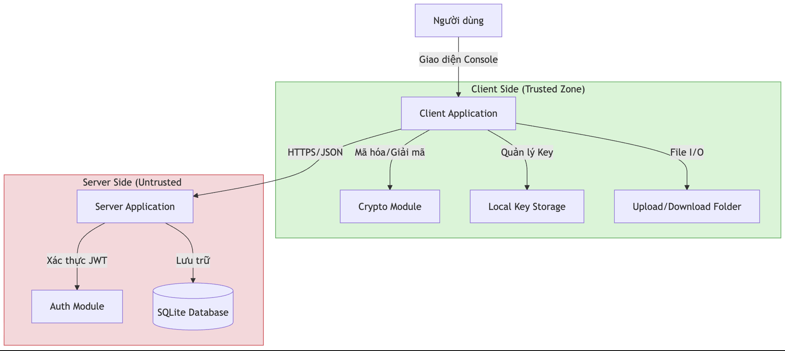

# BÁO CÁO ĐỒ ÁN 02 - ỨNG DỤNG CHIA SẺ GHI CHÚ


## MỤC LỤC
1. [Tổng quan ứng dụng](#1-tổng-quan-ứng-dụng)
2. [Thiết kế và kiến trúc](#2-thiết-kế-và-kiến-trúc)
3. [Kiểm thử và đánh giá](#3-kiểm-thử-và-đánh-giá)
---

## 1. TỔNG QUAN ỨNG DỤNG

### 1.1. Mục tiêu ứng dụng

**Secure Note Sharing Application** là ứng dụng chia sẻ ghi chú an toàn với mã hóa end-to-end (E2EE), được phát triển nhằm đảm bảo tính bảo mật và riêng tư tuyệt đối cho dữ liệu người dùng. Ứng dụng triển khai các cơ chế mật mã hiện đại để bảo vệ thông tin từ đầu đến cuối quá trình truyền tải và lưu trữ.

**Mục tiêu chính:**
- **Bảo mật tuyệt đối**: Dữ liệu được mã hóa end-to-end, server không thể đọc nội dung
- **Quản lý khóa an toàn**: Sử dụng ECDH để trao đổi khóa một cách bảo mật
- **Chia sẻ linh hoạt**: Hỗ trợ chia sẻ qua link tạm thời hoặc trực tiếp cho người dùng
- **Xác thực mạnh mẽ**: JWT token với thời gian hết hạn để bảo vệ phiên làm việc
- **Hỗ trợ đa dạng**: Upload/download mọi loại file với tên file gốc được bảo toàn

### 1.2. Kiến trúc hệ thống

Ứng dụng được xây dựng theo mô hình **Client-Server** với kiến trúc 3 tầng:

**Thành phần chính:**

1. **Server (Backend)**
   - Framework: Crow (C++ HTTP server)
   - Database: SQLite3
   - Port: 8080
   - Chức năng: Xử lý API, quản lý xác thực, lưu trữ dữ liệu đã mã hóa

2. **Client (Frontend)**
   - Giao diện: Console Application (C++)
   - HTTP Client: cpp-httplib
   - Chức năng: Tương tác người dùng, mã hóa/giải mã dữ liệu

3. **Common Crypto Library**
   - OpenSSL 3.x
   - Chức năng: Cung cấp các hàm mật mã cho cả client và server

### 1.3. Cách chạy chương trình từ mã nguồn

#### **Bước 1: Chuẩn bị môi trường**

**Yêu cầu hệ thống:**
- Windows 10/11
- MSYS2 với GCC 14.2.0 hoặc cao hơn
- OpenSSL 3.x

**Cài đặt công cụ:**

```powershell
# 1. Cài MSYS2
winget install MSYS2.MSYS2

# 2. Mở MSYS2 UCRT64 terminal và cài các package cần thiết
pacman -Syu
pacman -S mingw-w64-ucrt-x86_64-gcc mingw-w64-ucrt-x86_64-openssl

# 3. Thêm vào PATH (PowerShell)
$env:PATH = "C:\msys64\ucrt64\bin;$env:PATH" (thay đổi đường dẫn theo nơi cài đặt) 
```

**Kiểm tra cài đặt:**
```powershell
g++ --version      # Phải >= 14.2.0
openssl version    # Phải OpenSSL 3.x
```

#### **Bước 2: Build ứng dụng**
```powershell
# Từ thư mục gốc của project
.\build_all.ps1
```

Script này sẽ tự động:
- Biên dịch SQLite3
- Biên dịch tất cả module của server (server_main, Auth, Database, Crypto)
- Biên dịch tất cả module của client (client_main, client_app_logic, network, Crypto)
- Link các module và tạo file thực thi
- Hiển thị kết quả từng bước

#### **Bước 3: Chạy ứng dụng**

**Mở 2 terminal riêng biệt:**

*Terminal 1 - Khởi động Server:*
```powershell
.\server_app.exe
```
Kết quả mong đợi:
```
Server running on port 8080
```

*Terminal 2 - Chạy Client:*
```powershell
.\client_app.exe
```

Menu client sẽ hiển thị:
```
=== SECURE NOTE APP ===
1. Dang ky
2. Dang nhap
3. Upload file
4. Tai file ve
5. Liet ke ghi chu
6. Xoa ghi chu
7. Tao link chia se tam thoi
8. Xem ghi chu ban da chia se
9. Truy cap link chia se
10. Huy chia se
0. Thoat
Chon:
```
#### **Bước 4: Sử dụng cơ bản**
**Luồng sử dụng điển hình:**
1. **Đăng ký tài khoản**
   - Chọn option `1`
   - Nhập username và password
   - Hệ thống tự động tạo cặp khóa ECDH

2. **Đăng nhập**
   - Chọn option `2`
   - Nhập username và password
   - Nhận JWT token (có hiệu lực 30 phút)

3. **Upload file**
   - Đặt file cần upload vào thư mục `upload/`
   - Chọn option `3`
   - Nhập tên file
   - File được mã hóa tự động trước khi gửi lên server

4. **Xem danh sách ghi chú**
   - Chọn option `5`
   - Hiển thị tất cả notes đã upload

5. **Tải file về**
   - Chọn option `4`
   - Nhập ID của note
   - File được giải mã tự động và lưu vào `download/`

6. **Chia sẻ file**
   - Chọn option `7`
   - Nhập ID note, danh sách username được phép truy cập, thời gian hết hạn
   - Nhận link chia sẻ tạm thời

7. **Truy cập link chia sẻ**
   - Chọn option `9`
   - Nhập token từ link
   - File được giải mã và lưu vào `download/`

### 1.4. Các chức năng đã triển khai

#### **A. Chức năng cơ bản**

| STT | Chức năng | Mô tả | API Endpoint |
|-----|-----------|-------|--------------|
| 1 | **Đăng ký người dùng** | Tạo tài khoản mới với password được hash bằng SHA-256 và PBKDF2. Tự động sinh cặp khóa ECDH (Receive Key) cho người dùng. | `POST /register` |
| 2 | **Đăng nhập** | Xác thực username/password, trả về JWT token có thời gian sống 30 phút. | `POST /login` |
| 3 | **Upload ghi chú** | Mã hóa nội dung bằng AES-256-CBC, upload lên server kèm wrapped key và IV. Hỗ trợ mọi loại file. | `POST /upload` |
| 4 | **Liệt kê ghi chú** | Hiển thị danh sách các note của người dùng hiện tại (chỉ metadata, không có nội dung). | `GET /notes` |
| 5 | **Xem ghi chú** | Tải về note theo ID, giải mã và hiển thị nội dung. | `GET /note/:id` |
| 6 | **Xóa ghi chú** | Xóa note khỏi database (chỉ chủ sở hữu). | `DELETE /note/:id` |
| 7 | **Download file** | Tải về file đã mã hóa, giải mã và lưu với tên file gốc. | `POST /download_note` |

#### **B. Chức năng chia sẻ nâng cao**

| STT | Chức năng | Mô tả | API Endpoint |
|-----|-----------|-------|--------------|
| 8 | **Tạo link chia sẻ** | Tạo link tạm thời với whitelist username. Mỗi người được phép truy cập có Send Public Key và Wrapped Key riêng. | `POST /share/link` |
| 9 | **Truy cập link chia sẻ** | Truy cập note qua token, tự động giải mã bằng Session Key từ ECDH. | `GET /share/:token` |
| 10 | **Hủy chia sẻ** | Xóa link chia sẻ (chỉ người tạo link). | `DELETE /share/:token` |
| 11 | **Xem notes đã chia sẻ** | Liệt kê các note mà người dùng đã chia sẻ cho người khác, bao gồm danh sách người được chia sẻ. | `GET /myshares` |
| 12 | **Lấy public key** | Truy vấn Receive Public Key của user khác (để thực hiện ECDH). | `GET /user/:username/pubkey` |

#### **C. Bảo mật và xác thực**

| STT | Chức năng | Mô tả | Chi tiết kỹ thuật |
|-----|-----------|-------|-------------------|
| 1 | **JWT Authentication** | Xác thực mọi request yêu cầu quyền (trừ register/login). Token có thời gian sống 30 phút. | Header: `Authorization: Bearer <token>` |
| 2 | **Password Hashing** | Password không lưu plaintext, chỉ lưu hash. | SHA-256 + PBKDF2 (10,000 iterations) với salt ngẫu nhiên |
| 3 | **End-to-End Encryption** | Server không thể đọc nội dung file. Chỉ client có khóa giải mã. | AES-256-CBC với key được wrap |
| 4 | **Key Wrapping** | Các file key được wrap bằng Master Key (từ password) hoặc Session Key (từ ECDH). | AES-256-CBC key wrapping |
| 5 | **Access Control** | Người dùng chỉ truy cập được note của mình hoặc note được chia sẻ hợp lệ. | Database + Token validation |

### 1.6. Công nghệ sử dụng

**Bảng tổng hợp:**

| Thành phần | Công nghệ | Phiên bản | Mục đích |
|------------|-----------|-----------|----------|
| **Ngôn ngữ** | C++ | C++17 | Ngôn ngữ lập trình chính |
| **Compiler** | GCC (MSYS2) | 14.2.0 | Biên dịch mã nguồn |
| **Server Framework** | Crow | Header-only | HTTP server với routing |
| **HTTP Client** | cpp-httplib | Header-only | HTTP client cho test và client app |
| **Database** | SQLite3 | 3.x | Lưu trữ dữ liệu đã mã hóa |
| **JSON Parser** | nlohmann/json | Latest | Parse/serialize JSON |
| **Cryptography** | OpenSSL | 3.x | Các hàm mật mã |
| **Key Exchange** | ECDH | secp256k1 | Trao đổi khóa an toàn |
| **Encryption** | AES-256-CBC | - | Mã hóa đối xứng |
| **Key Derivation** | PBKDF2-SHA256 | 10k iterations | Sinh khóa từ password |
| **Authentication** | JWT | Custom | Xác thực token |

### 1.5. Cấu trúc thư mục
```
project_02_source/
├── server/                      # Server code
│   ├── server_main.cpp          # API endpoints (14 APIs)
│   ├── Auth.cpp / Auth.h        # JWT authentication
│   └── Database.cpp / Database.h # SQLite operations (5 tables)
│
├── client/                      # Client code  
│   ├── client_app_logic.cpp/.h  # Business logic
│   └── network.cpp / network.h  # HTTP client wrapper
│
├── common/                      # Shared code
│   ├── Crypto.cpp / Crypto.h    # Crypto functions
│   └── Protocol.h               # Data structures
│
├── test/                        # Test suite
│   ├── auto_test.cpp            # 13 automated tests
│   ├── test_config.json         # Test configuration
│   ├── build_and_run.ps1        # Test runner script
│   └── *.md                     # 40 manual test cases
│
├── vendor/                      # Third-party libraries
│   ├── crow_all.h               # HTTP server
│   ├── httplib.h                # HTTP client
│   ├── json.hpp                 # JSON parser
│   ├── sqlite3.c / sqlite3.h    # Database
│   └── asio_lib/                # Async I/O (for Crow)
│
├── keys/                        # User private keys (encrypted)
├── upload/                      # Upload staging area
├── download/                    # Downloaded files
│
├── build_all.ps1                # Build script
└── secure_notes.db              # SQLite database (created at runtime)
```
## 2. THIẾT KẾ VÀ KIẾN TRÚC

### 2.1. Kiến trúc hệ thống

Hệ thống được thiết kế theo mô hình **Client-Server** truyền thống nhưng với sự khác biệt quan trọng trong việc xử lý dữ liệu: **Mô hình Zero-Knowledge**. Server chỉ đóng vai trò là kho lưu trữ dữ liệu mù (blind storage) và bộ điều phối xác thực, trong khi toàn bộ logic mã hóa và giải mã diễn ra tại Client.

**Sơ đồ kiến trúc tổng quát:**


*(Sơ đồ trên mô tả luồng dữ liệu và các vùng tin cậy)*

### 2.2. Các thành phần chính

#### **1. Client Application (Frontend)**
- **Vai trò**: Giao tiếp với người dùng, thực hiện các phép toán mật mã, và gửi request đến server.
- **Đặc điểm**:
  - **Stateful**: Lưu trữ trạng thái đăng nhập (JWT) và keys tạm thời.
  - **Secure**: Không bao giờ gửi khóa giải mã (Private Key) ra ngoài.
  - **Interactive**: Menu điều khiển qua dòng lệnh.

#### **2. Server Application (Backend)**
- **Vai trò**: Cung cấp RESTful API, quản lý cơ sở dữ liệu, và điều phối chia sẻ.
- **Đặc điểm**:
  - **Stateless**: Sử dụng JWT cho xác thực, không lưu session server-side.
  - **Passive**: Chỉ phản hồi request, không chủ động xử lý dữ liệu mã hóa.
  - **Concurrent**: Sử dụng Crow framework để xử lý nhiều request đồng thời.

#### **3. Database (Storage)**
- **Vai trò**: Lưu trữ bền vững dữ liệu người dùng và file.
- **Đặc điểm**:
  - **Relational**: Sử dụng SQLite với 5 bảng quan hệ chặt chẽ.
  - **Encrypted Content**: Các trường nội dung (`encrypted_content`, `wrapped_key`) đều lưu dưới dạng Hex/Base64 của dữ liệu đã mã hóa.

#### **4. Crypto Module (Shared Library)**
- **Vai trò**: Cung cấp các hàm mật mã chuẩn cho cả Client và Server.
- **Đặc điểm**:
  - **Wrapper**: Bao đóng các hàm phức tạp của OpenSSL thành API đơn giản (ví dụ: `encryptAES`, `hashSHA256`).
  - **Consistency**: Đảm bảo thuật toán thống nhất giữa hai đầu.


### 2.3. Mục đích thiết kế

Thiết kế của hệ thống tuân theo 3 nguyên tắc bảo mật cốt lõi:

1.  **Confidentiality (Tính bí mật)**:
    *   **End-to-End Encryption**: Dữ liệu được mã hóa tại máy người gửi và chỉ được giải mã tại máy người nhận. Server chỉ thấy rác (ciphertext).
    *   **Key Wrapping**: Khóa mã hóa file (File Key) được mã hóa bằng khóa của người nhận (Wrapping), đảm bảo an toàn khi truyền tải.

2.  **Integrity (Tính toàn vẹn)**:
    *   Sử dụng AES-256-CBC. Mặc dù CBC không có tính năng xác thực tích hợp như GCM, nhưng hệ thống đảm bảo tính toàn vẹn thông qua việc kiểm soát luồng dữ liệu và hash SHA-256 cho mật khẩu.

3.  **Availability (Tính sẵn sàng)**:
    *   Kiến trúc REST API giúp hệ thống dễ dàng mở rộng.
    *   SQLite đảm bảo dữ liệu luôn sẵn sàng truy xuất mà không phụ thuộc vào database server phức tạp.

### 2.4. Sơ đồ luồng hoạt động

#### **A. Luồng Đăng ký & Tạo khóa (Registration Flow)**


#### **B. Luồng Upload File (Secure Upload Flow)**


#### **C. Luồng Chia sẻ qua Link (Whitelist Sharing Flow)**


---
## 3. KIỂM THỬ VÀ ĐÁNH GIÁ
### 3.1. Phương pháp kiểm thử
Chương trình cung cấp file `auto_test.cpp ` trong thư mục test nhằm kiểm thử tự động chương trình
-  **Mục tiêu**: Kiểm tra sự tương tác giữa Client và Server qua API.
-  **Phạm vi**: Bao phủ các luồng nghiệp vụ chính: Đăng ký, Đăng nhập, Upload, Download, Chia sẻ, và Kiểm soát quyền truy cập.
-  **Cách thức**: Gửi các HTTP Request (POST/GET/DELETE) với payload JSON chuẩn và kiểm tra HTTP Status Code cũng như nội dung JSON trả về.
### 3.2. Cách sử dụng
**Quy trình thực hiện kiểm thử tự động:**
1.  **Chuẩn bị**: Đảm bảo `server_app.exe` đã được build và remote database (nếu đã chạy chương trình trước khi test) bằng lệnh:
```
Remove-Item secure_notes.db
```
3.  **Khởi động Server**: Mở một terminal và chạy server:
```powershell
.\server_app.exe
```
4.  **Build và chạy Test**: Mở terminal thứ hai và build rồi chạy file test:
```powershell
g++ test/auto_test.cpp -o auto_test.exe  -std=c++17  -I vendor -D_WIN32_WINNT=0x0A00  -lws2_32 -lwsock32
.\auto_test.exe
```
5.  **Đánh giá**: Chương trình sẽ tự động chạy lần lượt 13 test cases và in kết quả (PASS/FAIL) ra màn hình với màu sắc trực quan.
### 3.3. Các test case  và kết quả kiểm thử 
**Nhóm 1: Authentication (Xác thực)**
***Test 1.1 - Đăng ký thành công***:
*  **Logic**: Gửi request `POST /register` với thông tin của user **Alice** (username/password được lấy từ từ test_config.json).
*  **Kết quả**: Server trả về HTTP 200 và `success: true`.
* **Ý nghĩa**: Chức năng đăng ký hoạt động, mật khẩu được hash và lưu trữ an toàn, cặp khóa ECDH được sinh thành công.

***Test 1.2 - Đăng ký trùng username***:
*  **Logic**: Gửi lại request `POST /register` với cùng username của **Alice**.
*  **Kết quả**: Server trả về HTTP 400 (Bad Request) để ngăn chặn trùng lặp.
* **Ý nghĩa**: Hệ thống ngăn chặn việc tạo tài khoản trùng lặp, đảm bảo tính toàn vẹn dữ liệu người dùng.

***Test 1.3 - Đăng nhập thành công***:
*  **Logic**: Gửi `POST /login` với đúng username/password của **Alice**.
*  **Kết quả**: Server trả về HTTP 200 kèm theo JWT Token và Salt.
* **Ý nghĩa**: Xác thực người dùng thành công, JWT token được cấp cho user.

***Test 1.4 - Đăng nhập sai password***:
*  **Logic**: Gửi `POST /login` với username của **Alice** nhưng sai password.
*  **Kết quả**: Server trả về HTTP 401 (Unauthorized).
* **Ý nghĩa**: Hệ thống từ chối truy cập khi thông tin xác thực không chính xác, bảo vệ tài khoản người dùng.

***Test 1.5 - Đăng nhập user không tồn tại***:
*  **Logic**: Gửi `POST /login` với một username ngẫu nhiên không tồn tại trong database.
*  **Kết quả**: Server trả về HTTP 401.
* **Ý nghĩa**: Hệ thống xử lý an toàn với các tài khoản không tồn tại.

***Test 1.7 - Request không có token***:
*  **Logic**: Gửi `GET /notes` mà không đính kèm header `Authorization`.
*  **Kết quả**: Server từ chối với HTTP 401.
* **Ý nghĩa**: Đảm bảo yêu cầu xác thực trước khi truy cập.
**Nhóm 2: Chức năng cơ bản**

***Test 2.1 - Upload note***:
*  **Logic**: Dùng token của **Alice** gửi `POST /upload` với nội dung file giả dạng base64 và tên file "test.txt".
*  **Kết quả**: Server lưu thành công, trả về HTTP 200 và `note_id`.
* **Ý nghĩa**: Chức năng upload hoạt động, server chấp nhận và lưu trữ dữ liệu đã mã hóa cùng metadata.

***Test 2.2 - List notes***:
*  **Logic**: Gửi `GET /notes` với token của **Alice**.
*  **Kết quả**: Server trả về danh sách JSON chứa note vừa upload.
* **Ý nghĩa**: Người dùng có thể truy xuất danh sách dữ liệu của chính mình đã upload.

***Test 2.3 - Get note by ID***:
*  **Logic**: Gửi `GET /note/{id}` với ID nhận được từ Test 2.1.
*  **Kết quả**: Server trả về đúng nội dung file, tên file và các metadata khác.
* **Ý nghĩa**: Dữ liệu tải về toàn vẹn, bao gồm nội dung mã hóa và tên file gốc.
**Nhóm 3: Kiểm soát quyền truy cập**

***Test 3.1 - Truy cập trái phép***:
*  **Logic**: Dùng token của **Bob** (đã đăng ký và đăng nhập) để gọi `GET /note/{id}` của **Alice**.
*  **Kết quả**: Server chặn truy cập với HTTP 403 (Forbidden).
* **Ý nghĩa**: Access Control hoạt động hiệu quả. Người dùng không thể truy cập dữ liệu của người khác nếu không được chia sẻ.

***Test 3.2 - Tạo share link (Whitelist)***:
*  **Logic**: **Alice** tạo link chia sẻ note cho **Bob** qua `POST /share/link` (kèm theo Wrapped Key cho Bob).
*  **Kết quả**: Server trả về HTTP 200 và một link share duy nhất.
* **Ý nghĩa**: Chức năng chia sẻ hoạt động, tạo ra token truy cập tạm thời cho người được ủy quyền.

***Test 3.3 - Truy cập link chia sẻ***:
*  **Logic**: **Bob** dùng token của mình để truy cập `GET /share/{share_token}`.
*  **Kết quả**: Server cho phép (HTTP 200) vì **Bob** có trong whitelist.
* **Ý nghĩa**: Người được chia sẻ có thể truy cập nội dung thành công.

***Test 3.4 - Truy cập link đã hết hạn***:
*  **Logic**: **Alice** tạo link chia sẻ cho **Bob** với thời hạn cực ngắn (2 giây). Hệ thống chờ 3 giây rồi dùng token của **Bob** để truy cập.
*  **Kết quả**: Server từ chối truy cập với HTTP 403 (Forbidden).
*  **Ý nghĩa**: Đảm bảo tính năng giới hạn thời gian hoạt động đúng.=
**Nhóm 4: My Shares API**

***Test 4.1 - Kiểm tra danh sách chia sẻ***:
*  **Logic**: **Alice** gọi `GET /myshares`.
*  **Kết quả**: Server trả về danh sách chứa thông tin link chia sẻ vừa tạo, bao gồm danh sách người được chia sẻ (`shared_with`).
* **Ý nghĩa**: Người dùng có thể theo dõi và quản lý các tài nguyên mình đã chia sẻ.

### 3.4 Đánh giá kiểm thử
1. **Xác thực:** Các test case nhóm 1 chứng tỏ rằng đăng ký và đăng nhập hoạt động đúng yêu cầu, đảm bảo độ an toàn.
2. **Mã hóa/Giải mã:** Ở Test 2.1 (Upload), client gửi khóa của file (được mã hóa) lên server cùng vời nội dung file. Ở Test 2.3 (Download), client tải khóa này về, dùng mật khẩu của mình để giải mã ra khóa của file, sau đó dùng khóa của file để giải mã file.
4. **Giới hạn truy cập:** Test 3.4 đảm bảo liên kết hết hạn không thể truy cập.
5. **Mã hóa đầu-cuối:** Test 3.2 (Tạo share link) và 3.3 (Truy cập link chia sẻ) chứng minh luồng trao đổi khóa hoạt động đúng, server đóng vai trò trung gian chuyển phát khóa đã mã hóa mà không biết nội dung khóa.
